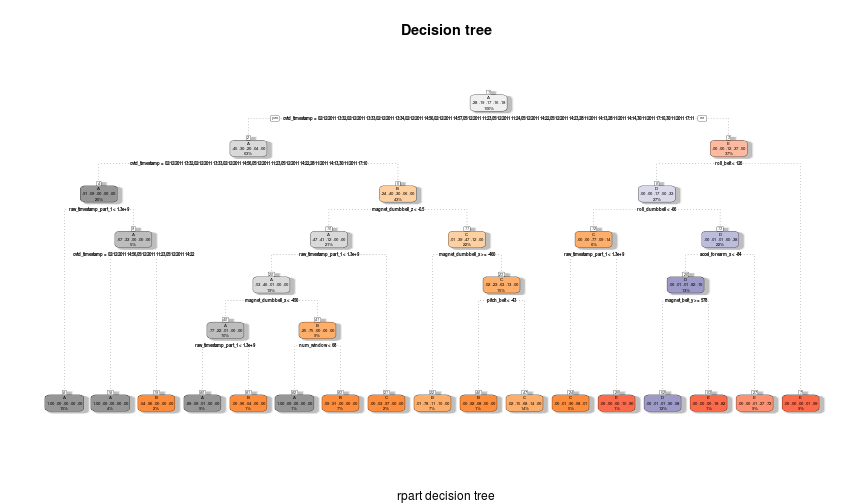
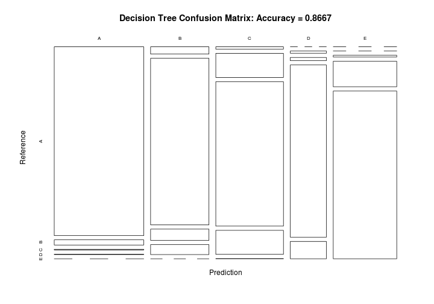
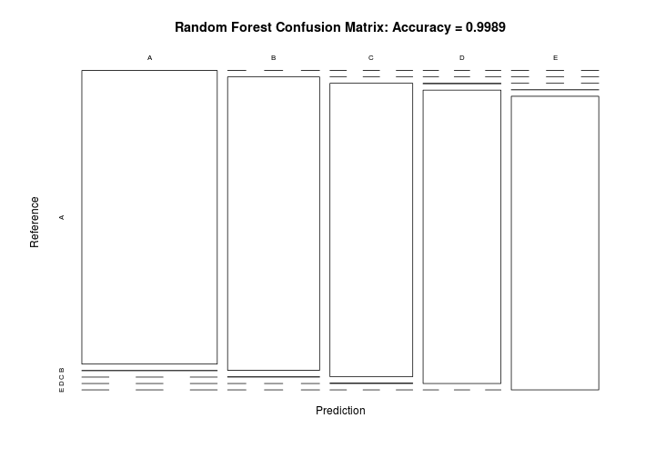

# Final Project Report - Practical Machine Learning Course

## Project info

Using devices such as Jawbone Up, Nike FuelBand, and Fitbit it is now possible to collect a large amount of data about personal activity relatively inexpensively. These type of devices are part of the quantified self movement - a group of enthusiasts who take measurements about themselves regularly to improve their health, to find patterns in their behavior, or because they are tech geeks. One thing that people regularly do is quantify how much of a particular activity they do, but they rarely quantify how well they do it. In this project, your goal will be to use data from accelerometers on the belt, forearm, arm, and dumbell of 6 participants. They were asked to perform barbell lifts correctly and incorrectly in 5 different ways. More information is available from the website here: [Groupware@LES] (http://groupware.les.inf.puc-rio.br/har) (see the section on the Weight Lifting Exercise Dataset).

Human Activity Recognition - **HAR** - has emerged as a key research area in the last years and is gaining increasing attention by the pervasive computing research community (see picture below, that illustrates the increasing number of publications in HAR with wearable accelerometers), especially for the development of context-aware systems. There are many potential applications for HAR, like: elderly monitoring, life log systems for monitoring energy expenditure and for supporting weight-loss programs, and digital assistants for weight lifting exercises. 

[The training data for this project are available here] (https://d396qusza40orc.cloudfront.net/predmachlearn/pml-training.csv)

[The test data are available here] (https://d396qusza40orc.cloudfront.net/predmachlearn/pml-testing.csv)

[The data for this project come from this source] (http://groupware.les.inf.puc-rio.br/har). If you use the document you create for this class for any purpose please cite them as they have been very generous in allowing their data to be used for this kind of assignment.

The goal of your project is to predict the manner in which they did the exercise. This is the “classe” variable in the training set. You may use any of the other variables to predict with. You should create a report describing how you built your model, how you used cross validation, what you think the expected out of sample error is, and why you made the choices you did. You will also use your prediction model to predict 20 different test cases.

## Loading data


```r
#download files from the urls provided
#train_url <- "http://d396qusza40orc.cloudfront.net/predmachlearn/pml-training.csv"
#download.file(url=train_url, destfile="training.csv")

#test_url <- "http://d396qusza40orc.cloudfront.net/predmachlearn/pml-testing.csv"
#download.file(url=test_url, destfile="testing.csv")

#read in training and testing data
training <- read.csv("training.csv", na.strings=c("NA","#DIV/0!",""))
testing <- read.csv("testing.csv", na.strings=c("NA","#DIV/0!",""))
```

## Loading needed libraries


```r
library(caret)
library(rpart)
library(rpart.plot)
library(knitr)
library(RColorBrewer)
library(rattle)
library(randomForest)
library(e1071)
library(gmb)
```

```
## Error in library(gmb): there is no package called 'gmb'
```

## Split training/testing data


```r
inTrain <- createDataPartition(training$classe, p=0.6, list=FALSE)
myTraining <- training[inTrain, ]
myTesting <- training[-inTrain, ]
```


```r
dim(myTraining); dim(myTesting)
```

```
## [1] 11776   160
```

```
## [1] 7846  160
```

## Cleaning the data

Remove NearZeroVariance variables

```r
nzv <- nearZeroVar(myTraining, saveMetrics=TRUE)
myTraining <- myTraining[,nzv$nzv==FALSE]

nzv<- nearZeroVar(myTesting,saveMetrics=TRUE)
myTesting <- myTesting[,nzv$nzv==FALSE]
```
Remove the first column of the myTraining data set

```r
myTraining <- myTraining[c(-1)]
```
Clean variables with more than $60$ $\%$ NA

```r
trainingV3 <- myTraining
for(i in 1:length(myTraining)) {
    if( sum( is.na( myTraining[, i] ) ) /nrow(myTraining) >= .7) {
        for(j in 1:length(trainingV3)) {
            if( length( grep(names(myTraining[i]), names(trainingV3)[j]) ) == 1)  {
                trainingV3 <- trainingV3[ , -j]
            }   
        } 
    }
}
```
Set back to the original variable name

```r
myTraining <- trainingV3
rm(trainingV3)
```
Now let us do the exact same 3 transformations but for our myTesting and testing data sets

```r
clean1 <- colnames(myTraining)
clean2 <- colnames(myTraining[, -58])  # remove the classe column
myTesting <- myTesting[clean1]         # allow only variables in myTesting that are also in myTraining
testing <- testing[clean2]             # allow only variables in testing that are also in myTraining
```


```r
dim(myTesting); dim(testing)
```

```
## [1] 7846   58
```

```
## [1] 20 57
```
Coerce the data into the same type

```r
for (i in 1:length(testing) ) {
    for(j in 1:length(myTraining)) {
        if( length( grep(names(myTraining[i]), names(testing)[j]) ) == 1)  {
            class(testing[j]) <- class(myTraining[i])
        }      
    }      
}
```
To get the same class between testing and myTraining

```r
testing <- rbind(myTraining[2, -58] , testing)
testing <- testing[-1,]
```

# Prediction with Decision Trees


```r
set.seed(12345)
modFitA1 <- rpart(classe ~ ., data=myTraining, method="class")
fancyRpartPlot(modFitA1, main="Decision tree", sub="rpart decision tree", palettes = c("Greys", "Oranges"))
```

 
Prediction and sing confusion Matrix to test results

```r
predictionsA1 <- predict(modFitA1, myTesting, type = "class")
cmtree <- confusionMatrix(predictionsA1, myTesting$classe)
cmtree
```

```
## Confusion Matrix and Statistics
## 
##           Reference
## Prediction    A    B    C    D    E
##          A 2158   59    8    4    0
##          B   54 1241   84   74    0
##          C   20  208 1247  207    2
##          D    0   10   15  794   80
##          E    0    0   14  207 1360
## 
## Overall Statistics
##                                          
##                Accuracy : 0.8667         
##                  95% CI : (0.859, 0.8741)
##     No Information Rate : 0.2845         
##     P-Value [Acc > NIR] : < 2.2e-16      
##                                          
##                   Kappa : 0.8313         
##  Mcnemar's Test P-Value : NA             
## 
## Statistics by Class:
## 
##                      Class: A Class: B Class: C Class: D Class: E
## Sensitivity            0.9668   0.8175   0.9115   0.6174   0.9431
## Specificity            0.9874   0.9665   0.9325   0.9840   0.9655
## Pos Pred Value         0.9681   0.8541   0.7405   0.8832   0.8602
## Neg Pred Value         0.9868   0.9567   0.9804   0.9292   0.9869
## Prevalence             0.2845   0.1935   0.1744   0.1639   0.1838
## Detection Rate         0.2750   0.1582   0.1589   0.1012   0.1733
## Detection Prevalence   0.2841   0.1852   0.2146   0.1146   0.2015
## Balanced Accuracy      0.9771   0.8920   0.9220   0.8007   0.9543
```
Plot decision tree confusion matrix

```r
plot(cmtree$table, col = cmtree$byClass, main = paste("Decision Tree Confusion Matrix: Accuracy =",
round(cmtree$overall['Accuracy'], 4)))
```

 

Prediction with random forests


```r
set.seed(12345)
modFitB1 <- randomForest(classe ~ ., data=myTraining)
predictionB1 <- predict(modFitB1, myTesting, type = "class")
cmrf <- confusionMatrix(predictionB1, myTesting$classe)
cmrf
```

```
## Confusion Matrix and Statistics
## 
##           Reference
## Prediction    A    B    C    D    E
##          A 2232    2    0    0    0
##          B    0 1516    2    0    0
##          C    0    0 1364    2    0
##          D    0    0    2 1283    0
##          E    0    0    0    1 1442
## 
## Overall Statistics
##                                           
##                Accuracy : 0.9989          
##                  95% CI : (0.9978, 0.9995)
##     No Information Rate : 0.2845          
##     P-Value [Acc > NIR] : < 2.2e-16       
##                                           
##                   Kappa : 0.9985          
##  Mcnemar's Test P-Value : NA              
## 
## Statistics by Class:
## 
##                      Class: A Class: B Class: C Class: D Class: E
## Sensitivity            1.0000   0.9987   0.9971   0.9977   1.0000
## Specificity            0.9996   0.9997   0.9997   0.9997   0.9998
## Pos Pred Value         0.9991   0.9987   0.9985   0.9984   0.9993
## Neg Pred Value         1.0000   0.9997   0.9994   0.9995   1.0000
## Prevalence             0.2845   0.1935   0.1744   0.1639   0.1838
## Detection Rate         0.2845   0.1932   0.1738   0.1635   0.1838
## Detection Prevalence   0.2847   0.1935   0.1741   0.1638   0.1839
## Balanced Accuracy      0.9998   0.9992   0.9984   0.9987   0.9999
```

Plot random forests confusion matrix


```r
plot(cmrf$table, col = cmtree$byClass, main = paste("Random Forest Confusion Matrix: Accuracy =", 
round(cmrf$overall['Accuracy'], 4)))
```


# Prediction with Generalized Boosted Regression

```r
set.seed(12345)
fitControl <- trainControl(method = "repeatedcv",
                           number = 5,
                           repeats = 1)

gbmFit1 <- train(classe ~ ., data=myTraining, method = "gbm",
                 trControl = fitControl,
                 verbose = FALSE)


gbmFinMod1 <- gbmFit1$finalModel

gbmPredTest <- predict(gbmFit1, newdata=myTesting)
gbmAccuracyTest <- confusionMatrix(gbmPredTest, myTesting$classe)
gbmAccuracyTest
```

```
## Confusion Matrix and Statistics
## 
##           Reference
## Prediction    A    B    C    D    E
##          A 2232    4    0    0    0
##          B    0 1511    3    0    0
##          C    0    3 1353    2    0
##          D    0    0   12 1283    5
##          E    0    0    0    1 1437
## 
## Overall Statistics
##                                           
##                Accuracy : 0.9962          
##                  95% CI : (0.9945, 0.9974)
##     No Information Rate : 0.2845          
##     P-Value [Acc > NIR] : < 2.2e-16       
##                                           
##                   Kappa : 0.9952          
##  Mcnemar's Test P-Value : NA              
## 
## Statistics by Class:
## 
##                      Class: A Class: B Class: C Class: D Class: E
## Sensitivity            1.0000   0.9954   0.9890   0.9977   0.9965
## Specificity            0.9993   0.9995   0.9992   0.9974   0.9998
## Pos Pred Value         0.9982   0.9980   0.9963   0.9869   0.9993
## Neg Pred Value         1.0000   0.9989   0.9977   0.9995   0.9992
## Prevalence             0.2845   0.1935   0.1744   0.1639   0.1838
## Detection Rate         0.2845   0.1926   0.1724   0.1635   0.1832
## Detection Prevalence   0.2850   0.1930   0.1731   0.1657   0.1833
## Balanced Accuracy      0.9996   0.9975   0.9941   0.9975   0.9982
```

# Predicting Results on the Test Data

Random Forests gave an Accuracy in the myTesting dataset of $99.82\%$, which was more accurate that what I got from the Decision Trees or GBM. The expected out-of-sample error is $100-99.82 = 0.18\%$.


```r
predictionB2 <- predict(modFitB1, testing, type = "class")
predictionB2
```

```
## 22  3  4  5  6  7  8  9 10 11 12 13 14 15 16 17 18 19 20 21 
##  B  A  B  A  A  E  D  B  A  A  B  C  B  A  E  E  A  B  B  B 
## Levels: A B C D E
```
Write the results to a folder as a text file for submission

```r
pml_write_files = function(x){
    n = length(x)
    for(i in 1:n){
        filename = paste0("problem_id_",i,".txt")
        write.table(x[i],file=filename,quote=FALSE,row.names=FALSE,col.names=FALSE)
    }
}

pml_write_files(predictionB2)
```
